# はじめに
この記事は、[Docker Compose と Amazon ECS を利用したソフトウェアデリバリの自動化](https://aws.amazon.com/jp/blogs/news/automated-software-delivery-using-docker-compose-and-amazon-ecs/)を実施した際の備忘録です。

# 事前準備
以下の事前準備が必要となります。

1. AWS CLIのインストール
    - [【Windows/Mac/Linux（Ubuntu）】AWS CLIインストール方法](https://qiita.com/ryome/items/efd37c3a49b54859ba68)
2. AWS IAMアカウントの作成とaws configureの設定
    - [AWS IAMアカウントの作成とaws configureの設定](https://qiita.com/ryome/items/ff2804be600cd5dcd61a)
3. Linuxコマンドが使用できる環境構築
    - [wsl2にUbuntu環境を構築する【windows】](https://qiita.com/ryome/items/240f36923f5cb989da27)
    - ※ MacOSの方はターミナルからLinuxコマンドが使用できます。
4. Docker-composeを実行できる環境
    - [UbuntuにDockerをインストールする手順](https://qiita.com/ryome/items/4b6b934b1b2021acfa26)
    - [UbuntuにDocker-composeをインストールする手順](https://qiita.com/ryome/items/56a3263f347a08bd860f)
5. GitHubから資材をローカルに持ってくる
   - `git clone https://github.com/ryomeblog/demo-app-for-docker-compose.git` コマンドを実行する
6. zipコマンドのインストール
```
sudo apt-get install zip
または
sudo apt install zip
```

# 目次
以下の順番で進行します。

1. 動作確認
2. インフラ構築
3. パイプライン構築
4. デプロイ

# フォルダ構成

```
.
├── LICENSE
├── README.md
├── application
│   ├── docker-compose.yml
│   └── frontend
│       ├── Dockerfile
│       ├── myweb
│       │   ├── app.py
│       │   ├── static
│       │   │   ├── blue.png
│       │   │   ├── green.png
│       │   │   └── style.css
│       │   └── templates
│       │       ├── health.html
│       │       └── index.html
│       └── requirements.txt
├── infrastructure
│   └── cloudformation.yaml
└── pipeline
    └── cloudformation.yaml
```

# 実行手順
## 1. 動作確認
1. `docker-compose up -d` コマンドを実行する。
- コマンド
```
cd application/
docker-compose up -d
```
- 実行例
```
$ cd application/
$ docker-compose up -d
Creating network "application_demoapp" with the default driver
Creating volume "application_redisdata" with default driver
Building frontend
Sending build context to Docker daemon  81.41kB
Step 1/10 : FROM public.ecr.aws/docker/library/python:3.8-slim
3.8-slim: Pulling from docker/library/python
3f4ca61aafcd: Pull complete
3f487a3359db: Pull complete
4ea2d1d8495e: Pull complete
0e9cf1618b4f: Pull complete
b474c35f0abd: Pull complete
Digest: sha256:75b74d058401381b056d00f903dff58262d884025f772ed635a68e9699c36b87
Status: Downloaded newer image for public.ecr.aws/docker/library/python:3.8-slim
 ---> 61afbf515f15
Step 2/10 : LABEL maintainer=opomer@amazon.co.uk
 ---> Running in 415b32236a79
Removing intermediate container 415b32236a79
 ---> 1ffcbc1f9a8e
Step 3/10 : WORKDIR /app
 ---> Running in abcdb67f183e
Removing intermediate container abcdb67f183e
 ---> 092bb4e22a92
Step 4/10 : ADD requirements.txt /app/requirements.txt
 ---> b186ce5b1049
...省略
Status: Downloaded newer image for public.ecr.aws/docker/library/redis:6.2
Creating application_frontend_1 ... done
Creating application_backend_1  ... done
```

2. [http://localhost](http://localhost) へアクセスする。
3. 正常に動作すれば成功。

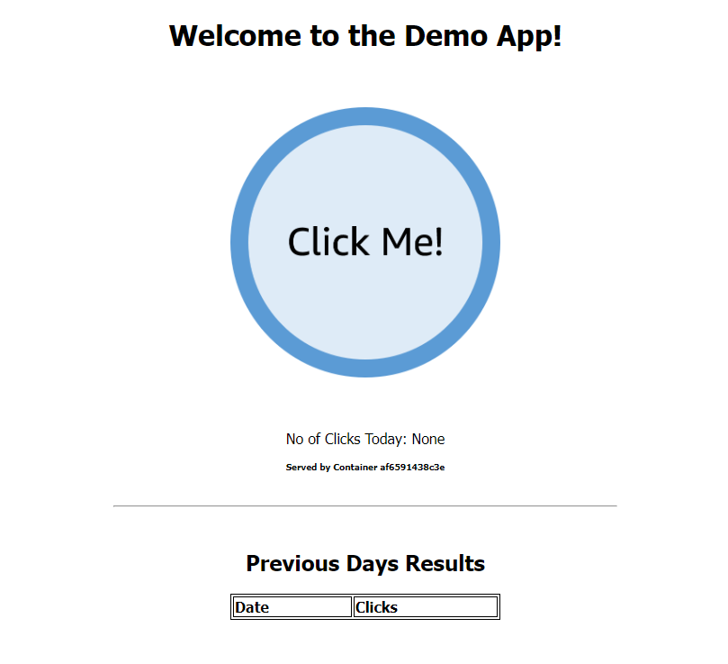

4. `docker-compose down` コマンドを実行する
- コマンド
```
docker-compose down
```
- 実行例
```
$ docker-compose down
Stopping application_backend_1  ... done
Stopping application_frontend_1 ... done
Removing application_backend_1  ... done
Removing application_frontend_1 ... done
Removing network application_demoapp
```

## 2. インフラ構築
1. CloudFormationを実行する。
- コマンド
```
cd ../infrastructure
aws cloudformation create-stack \
    --stack-name compose-infrastructure \
    --template-body file://cloudformation.yaml \
    --capabilities CAPABILITY_IAM
```
- 実行例
```
$ cd ../infrastructure
$ aws cloudformation create-stack \
>     --stack-name compose-infrastructure \
>     --template-body file://cloudformation.yaml \
>     --capabilities CAPABILITY_IAM
{
    "StackId": "arn:aws:cloudformation:【リージョン】:【AWS アカウントID】:stack/compose-infrastructure/hogehogefugafuga"
}
```
2. CloudFormationコンソールを開く。
    - https://【リージョン】.console.aws.amazon.com/cloudformation/home

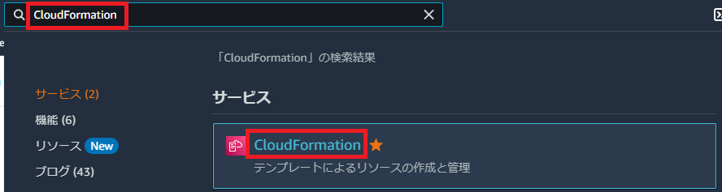

3. ステータスが `CREATE_COMPLETE` になったことを確認する。

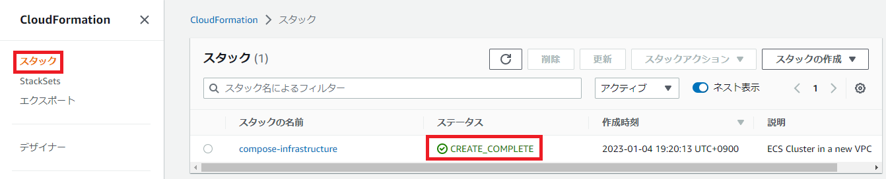

4. Outputsの値をローカル変数に格納する。
- コマンド
```
VPC_ID=$(aws cloudformation describe-stacks --stack-name compose-infrastructure --query "Stacks[0].Outputs[?OutputKey=='VpcId'].OutputValue" --output text)
ECS_CLUSTER=$(aws cloudformation describe-stacks --stack-name compose-infrastructure --query "Stacks[0].Outputs[?OutputKey=='ClusterName'].OutputValue" --output text)
LOADBALANCER_ARN=$(aws cloudformation describe-stacks --stack-name compose-infrastructure --query "Stacks[0].Outputs[?OutputKey=='LoadbalancerId'].OutputValue" --output text)
echo $VPC_ID
echo $ECS_CLUSTER
echo $LOADBALANCER_ARN
```
- 実行例
```
$ VPC_ID=$(aws cloudformation describe-stacks --stack-name compose-infrastructure --query "Stacks[0].Outputs[?OutputKey=='VpcId'].OutputValue" --output text)
$ ECS_CLUSTER=$(aws cloudformation describe-stacks --stack-name compose-infrastructure --query "Stacks[0].Outputs[?OutputKey=='ClusterName'].OutputValue" --output text)
$ LOADBALANCER_ARN=$(aws cloudformation describe-stacks --stack-name compose-infrastructure --query "Stacks[0].Outputs[?OutputKey=='LoadbalancerId'].OutputValue" --output text)
$ echo $VPC_ID
vpc-hogehogefugafuga
$ echo $ECS_CLUSTER
compose-infrastructure-cluster
$ echo $LOADBALANCER_ARN
arn:aws:elasticloadbalancing:【リージョン】:【AWS アカウントID】:loadbalancer/app/compose-infrastructure-alb/hogehogefugafuga
```

## 3. パイプライン構築
1. CloudFormationを実行する。
- コマンド
```
cd ../pipeline/
aws cloudformation create-stack \
     --stack-name compose-pipeline \
     --template-body file://cloudformation.yaml \
     --capabilities CAPABILITY_IAM \
     --parameters \
     ParameterKey=ExistingAwsVpc,ParameterValue=$VPC_ID \
     ParameterKey=ExistingEcsCluster,ParameterValue=$ECS_CLUSTER \
     ParameterKey=ExistingLoadbalancer,ParameterValue=$LOADBALANCER_ARN
```
- 実行例
```
$ cd infrastructure/
$ aws cloudformation create-stack \
>     --stack-name compose-infrastructure \
>     --template-body file://cloudformation.yaml \
>     --capabilities CAPABILITY_IAM
{
    "StackId": "arn:aws:cloudformation:【リージョン】:【AWS アカウントID】:stack/compose-infrastructure/hogehogefugafuga"
}
```
2. CloudFormationコンソールを開く。
    - https://【リージョン】.console.aws.amazon.com/cloudformation/home


3. ステータスが `CREATE_COMPLETE` になったことを確認する。

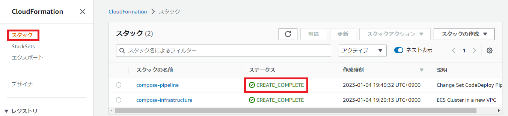

4. CodePipelineコンソールを開く。
    - https://【リージョン】.console.aws.amazon.com/codesuite/codepipeline/pipelines

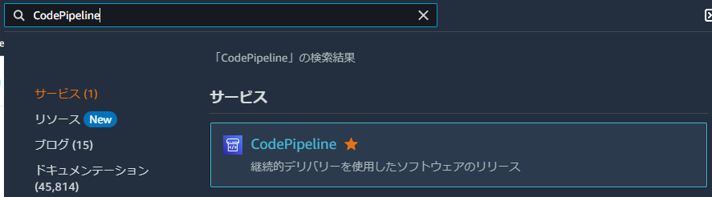

5. 作成したCodePipelineの詳細を開く。

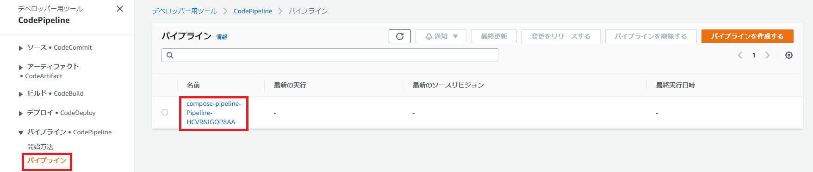

6. `S3Source` が失敗していることを確認する。
    - S3オブジェクトがないことによる失敗

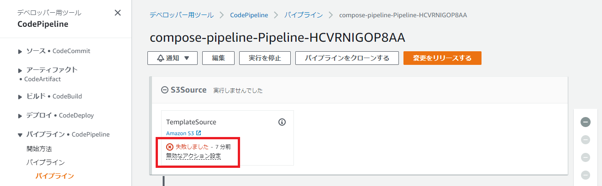

7. Outputsの値をローカル変数に格納する。
- コマンド
```
BUCKET_NAME=$(aws cloudformation describe-stacks --stack-name compose-pipeline --query "Stacks[0].Outputs[?OutputKey=='S3BucketName'].OutputValue" --output text)
echo $BUCKET_NAME
```
- 実行例
```
$ BUCKET_NAME=$(aws cloudformation describe-stacks --stack-name compose-pipeline --query "Stacks[0].Outputs[?OutputKey=='S3BucketName'].OutputValue" --output text)
$ echo $BUCKET_NAME
compose-pipeline-sourcebucket-hogehogefugafuga
```

## 4. デプロイ
1. `application` フォルダ内をZIP化する。
- コマンド
```
cd ../application
zip -r compose-bundle.zip .
```
- 実行例
```
$ cd ../application
$ zip -r compose-bundle.zip .
  adding: docker-compose.yml (deflated 44%)
  adding: frontend/ (stored 0%)
  adding: frontend/myweb/ (stored 0%)
  adding: frontend/myweb/app.py (deflated 54%)
  adding: frontend/myweb/templates/ (stored 0%)
  adding: frontend/myweb/templates/health.html (stored 0%)
  adding: frontend/myweb/templates/index.html (deflated 46%)
  adding: frontend/myweb/static/ (stored 0%)
  adding: frontend/myweb/static/style.css (deflated 52%)
  adding: frontend/myweb/static/green.png (deflated 4%)
  adding: frontend/myweb/static/blue.png (deflated 4%)
  adding: frontend/Dockerfile (deflated 36%)
  adding: frontend/requirements.txt (deflated 25%)
```
2. ZIP ファイルを S3 バケットにコピーする。
- コマンド
```
aws s3 cp compose-bundle.zip s3://$BUCKET_NAME/compose-bundle.zip
```
- 実行例
```
$ aws s3 cp compose-bundle.zip s3://$BUCKET_NAME/compose-bundle.zip
upload: ./compose-bundle.zip to s3://compose-pipeline-sourcebucket-hogehogefugafuga/compose-bundle.zip
```
3. CodePipelineコンソールを開く。
    - https://【リージョン】.console.aws.amazon.com/codesuite/codepipeline/pipelines


4. 作成したCodePipelineの詳細を開く。


5. CodePipelineが実行されていることを確認する。

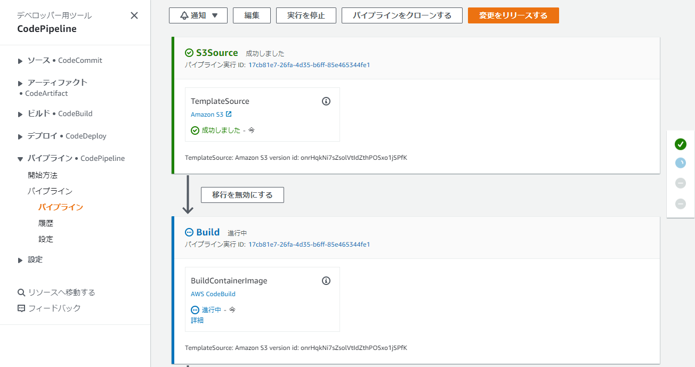

6. レビューを承認する。

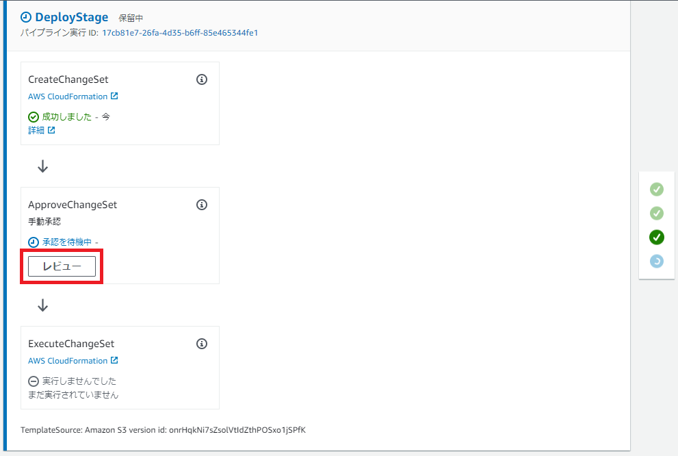
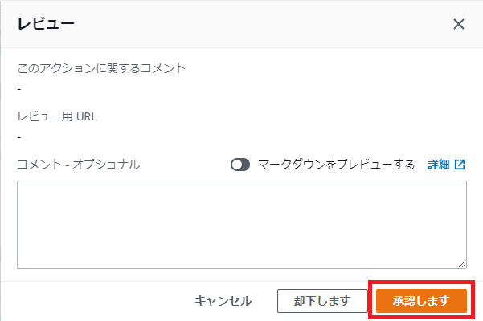

7. `ExecuteChangeSet` が成功したことを確認する。

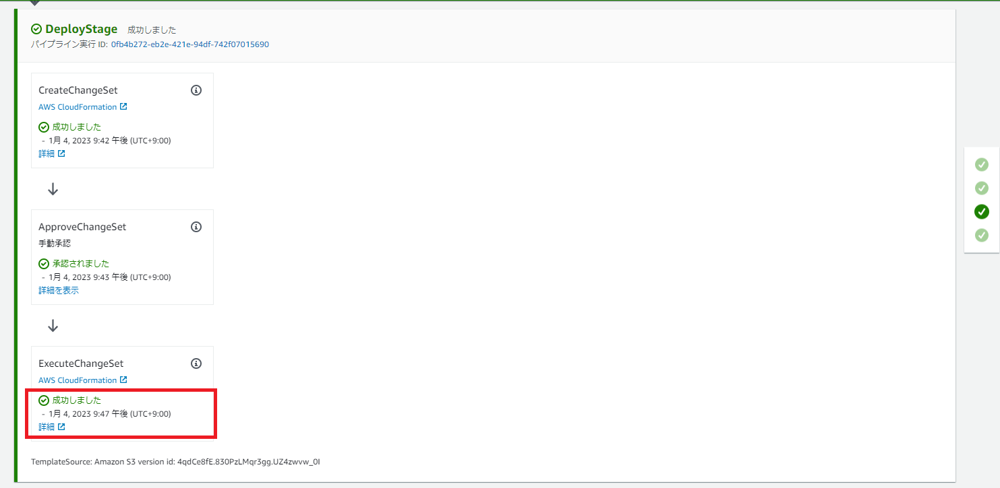

8. ロードバランサーのエンドポイントを取得
- コマンド
```
aws cloudformation describe-stacks --stack-name compose-infrastructure --query "Stacks[0].Outputs[?OutputKey=='LoadbalancerEndpoint'].OutputValue" --output text
```
- 実行例
```
$ aws cloudformation describe-stacks --stack-name compose-infrastructure --query "Stacks[0].Outputs[?OutputKey=='LoadbalancerEndpoint'].OutputValue" --output text
http://compose-infrastructure-alb-xxxxxxxxxx.【リージョン】.elb.amazonaws.com
```

9. `http://compose-infrastructure-alb-xxxxxxxxxx.【リージョン】.elb.amazonaws.com` にアクセスする。
10. ローカル実行時の画面と同じ画面が表示されれば成功。

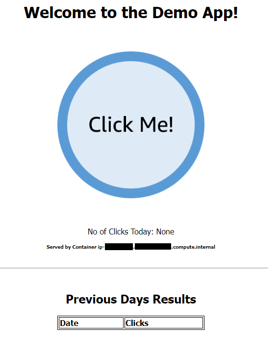

## 5. デプロイ 2回目
1. `frontend/myweb/app.py` を変更する。
- コマンド
```
sed -i 's/blue/green/g' frontend/myweb/app.py
cat frontend/myweb/app.py
```
- 実行例
```
$ sed -i 's/blue/green/g' frontend/myweb/app.py
$ cat frontend/myweb/app.py
import json
import os
import socket
from datetime import date

import pandas as pd
from flask import Flask, g, render_template, request
from redis import Redis

app = Flask(__name__)

redisurl = os.getenv('REDIS_URL')
hostname = socket.gethostname()

# Button Colour
buttoncolour = "green"
button = './static/{}.png'.format(buttoncolour)


def get_redis():
    if not hasattr(g, 'redis'):
        g.redis = Redis(host=redisurl, db=0, socket_timeout=5,
                        decode_responses=True)
    return g.redis


def generate_table():
    redis = get_redis()
    result = pd.DataFrame(columns=['Date', 'Clicks'])

    keys = redis.keys('*')
    for key in keys:
        val = redis.get(key)
        raw = json.dumps([{'Date': key, 'Clicks': val}])
        df = pd.read_json(raw)
        result = result.append(df, ignore_index=True)

    result = result.sort_values(by=['Date'], ascending=False)

    return result


@app.route('/', methods=['POST', 'GET'])
def index():

    redis = get_redis()
    today = str(date.today())

    if request.method == 'POST':
        redis.incr(today)

    global no_clicks
    no_clicks = redis.get(today)

    df = generate_table()

    return render_template(
        'index.html',
        no_clicks=no_clicks,
        hostname=hostname,
        logo=button,
        tables=[df.to_html(classes='data', index=False)],
        titles=df.columns.values)


@app.route('/health', methods=['GET'])
def health():
    return render_template('health.html')


if __name__ == '__main__':
    app.run(debug=True, host='0.0.0.0', port=80)
```
2. イメージを削除して、`docker-compose up -d --build` コマンドを実行する。
- コマンド
```
docker rmi frontend:latest

```
- 実行例
```
$ docker rmi frontend:latest
Untagged: frontend:latest
...省略
$ docker-compose up -d --build
Creating network "application_demoapp" with the default driver
Building frontend
Sending build context to Docker daemon  81.41kB
Step 1/10 : FROM public.ecr.aws/docker/library/python:3.8-slim
 ---> 61afbf515f15
...省略
Creating application_frontend_1 ... done
Creating application_backend_1  ... done
```
3. [http://localhost](http://localhost) へアクセスする。
4. 正常に動作すれば成功。

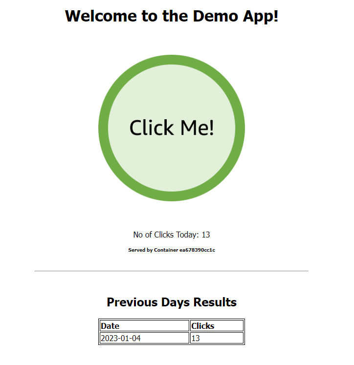

5. `compose-bundle.zip` を削除する。
- コマンド
```
rm compose-bundle.zip
```
- 実行例
```
$ rm compose-bundle.zip
```

5. `application` フォルダ内をZIP化する。
- コマンド
```
zip -r compose-bundle.zip .
```
- 実行例
```
$ zip -r compose-bundle.zip .
  adding: docker-compose.yml (deflated 44%)
  adding: frontend/ (stored 0%)
  adding: frontend/myweb/ (stored 0%)
  adding: frontend/myweb/app.py (deflated 54%)
  adding: frontend/myweb/templates/ (stored 0%)
  adding: frontend/myweb/templates/health.html (stored 0%)
  adding: frontend/myweb/templates/index.html (deflated 46%)
  adding: frontend/myweb/static/ (stored 0%)
  adding: frontend/myweb/static/style.css (deflated 52%)
  adding: frontend/myweb/static/green.png (deflated 4%)
  adding: frontend/myweb/static/blue.png (deflated 4%)
  adding: frontend/Dockerfile (deflated 36%)
  adding: frontend/requirements.txt (deflated 25%)
```
6. ZIP ファイルを S3 バケットにコピーする。
- コマンド
```
aws s3 cp compose-bundle.zip s3://$BUCKET_NAME/compose-bundle.zip
```
- 実行例
```
$ aws s3 cp compose-bundle.zip s3://$BUCKET_NAME/compose-bundle.zip
upload: ./compose-bundle.zip to s3://compose-pipeline-sourcebucket-hogehogefugafuga/compose-bundle.zip
```
7. CodePipelineコンソールを開く。
    - https://【リージョン】.console.aws.amazon.com/codesuite/codepipeline/pipelines


8. 作成したCodePipelineの詳細を開く。


9. CodePipelineが実行されていることを確認する。


10. レビューを承認する。


11. `ExecuteChangeSet` が成功したことを確認する。

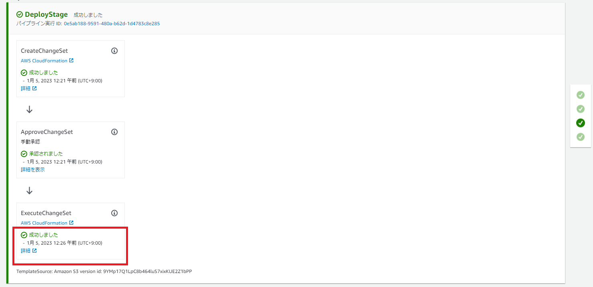

12. ロードバランサーのエンドポイントを取得
- コマンド
```
aws cloudformation describe-stacks --stack-name compose-infrastructure --query "Stacks[0].Outputs[?OutputKey=='LoadbalancerEndpoint'].OutputValue" --output text
```
- 実行例
```
$ aws cloudformation describe-stacks --stack-name compose-infrastructure --query "Stacks[0].Outputs[?OutputKey=='LoadbalancerEndpoint'].OutputValue" --output text
http://compose-infrastructure-alb-xxxxxxxxxx.【リージョン】.elb.amazonaws.com
```

13. `http://compose-infrastructure-alb-xxxxxxxxxx.【リージョン】.elb.amazonaws.com` にアクセスする。
14. ローカル実行時の画面と同じ画面が表示されれば成功。


# 躓きポイント

[Docker Compose と Amazon ECS を利用したソフトウェアデリバリの自動化](https://aws.amazon.com/jp/blogs/news/automated-software-delivery-using-docker-compose-and-amazon-ecs/)を手順通り実行していくと、CodePipelineの `ExecuteChangeSet` でエラーとなる。

## エラー内容

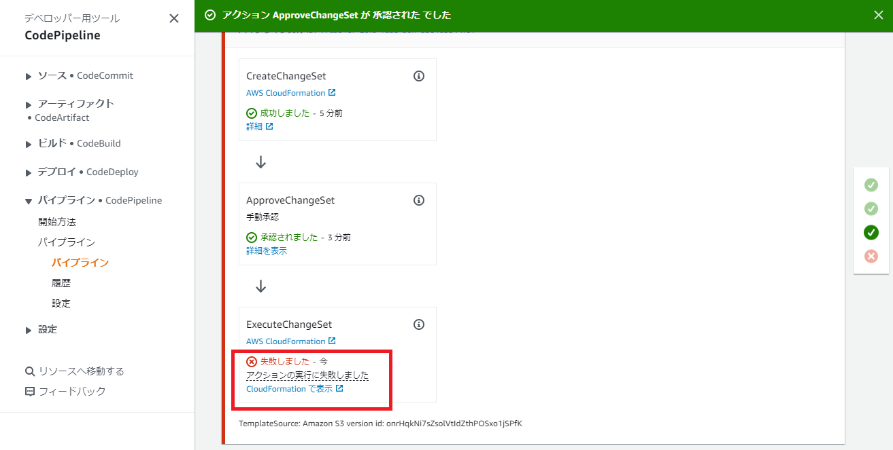

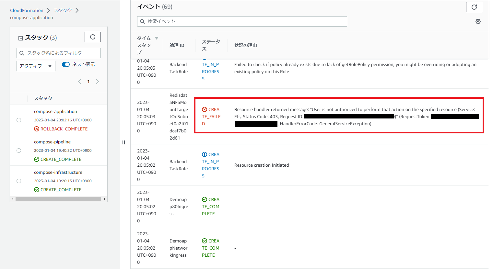

```
Resource handler returned message: "User is not authorized to perform that action on the specified resource (Service: Efs, Status Code: 403, Request ID: hogehogefugafuga)" (RequestToken: hogehogefugafuga, HandlerErrorCode: GeneralServiceException)
```

## 解決策

`pipeline` フォルダ内の `cloudformation.yaml` 184行目付近に `arn:aws:iam::aws:policy/AmazonVPCFullAccess` を追加する。

```
  ExtractBuildRole:
    Type: AWS::IAM::Role
    Properties:
      ManagedPolicyArns:
        - "arn:aws:iam::aws:policy/AmazonEC2ContainerRegistryReadOnly"
        - "arn:aws:iam::aws:policy/AmazonVPCFullAccess"
      AssumeRolePolicyDocument:
        Statement:
          - Action: sts:AssumeRole
            Effect: Allow
            Principal:
              Service: codebuild.amazonaws.com
          - Action: sts:AssumeRole
            Effect: Allow
            Principal:
              Service: cloudformation.amazonaws.com
        Version: "2012-10-17"
```


# お掃除
- コマンド
```
# アプリケーション削除
aws cloudformation delete-stack --stack-name compose-application

# S3オブジェクト削除
BUCKET_NAME=$(aws cloudformation describe-stacks --stack-name compose-pipeline --query "Stacks[0].Outputs[?OutputKey=='S3BucketName'].OutputValue" --output text)
echo $BUCKET_NAME
aws s3api delete-objects \
  --bucket $BUCKET_NAME --delete \
  "$(aws s3api list-object-versions \
    --bucket "${BUCKET_NAME}" \
    --output=json \
    --query='{Objects: Versions[].{Key:Key,VersionId:VersionId}}')"

# S3バケット削除
aws s3 rb s3://$BUCKET_NAME

# ECRリポジトリ削除
ECR_REPO=$(aws cloudformation describe-stacks --stack-name compose-pipeline --query "Stacks[0].Outputs[?OutputKey=='DemoAppEcrName'].OutputValue" --output text)
echo $ECR_REPO
aws ecr delete-repository --repository-name $ECR_REPO --force

# パイプライン削除
aws cloudformation delete-stack --stack-name compose-pipeline

# インフラ削除
aws cloudformation delete-stack --stack-name compose-infrastructure
```
- 実行例
```
$ aws cloudformation delete-stack --stack-name compose-application
$ BUCKET_NAME=$(aws cloudformation describe-stacks --stack-name compose-pipeline --query "Stacks[0].Outputs[?OutputKey=='S3BucketName'].OutputValue" --output text)
$ echo $BUCKET_NAME
compose-pipeline-sourcebucket-hogehoge
$ aws s3api delete-objects \
>   --bucket $BUCKET_NAME --delete \
>   "$(aws s3api list-object-versions \
>     --bucket "${BUCKET_NAME}" \
>     --output=json \
>     --query='{Objects: Versions[].{Key:Key,VersionId:VersionId}}')"
{
    "Deleted": [
        {
            "Key": "compose-bundle.zip",
            "VersionId": "hogehogefugafuga"
        },
        {
            "Key": "compose-bundle.zip",
            "VersionId": "hogehogefugafuga"
        },
        {
            "Key": "compose-pipeline-Pip/ExtractedC/hogehoge",
            "VersionId": "hogehogefugafuga"
        },
        {
            "Key": "compose-pipeline-Pip/ExtractedC/hogehoge",
            "VersionId": "hogehogefugafuga"
        },
        {
            "Key": "compose-pipeline-Pip/Source/hogehoge.zip",
            "VersionId": "hogehogefugafuga"
        },
        {
            "Key": "compose-pipeline-Pip/ExtractedC/hogehoge",
            "VersionId": "hogehogefugafuga"
        },
        {
            "Key": "compose-pipeline-Pip/Source/hogehoge.zip",
            "VersionId": "hogehogefugafuga"
        },
        {
            "Key": "compose-bundle.zip",
            "VersionId": "hogehogefugafuga"
        },
        {
            "Key": "compose-bundle.zip",
            "VersionId": "hogehogefugafuga"
        },
        {
            "Key": "compose-pipeline-Pip/ExtractedC/hogehoge",
            "VersionId": "hogehogefugafuga"
        },
        {
            "Key": "compose-pipeline-Pip/Source/hogehoge.zip",
            "VersionId": "hogehogefugafuga"
        },
        {
            "Key": "compose-pipeline-Pip/Source/hogehoge.zip",
            "VersionId": "hogehogefugafuga"
        }
    ]
}
$ aws s3 rb s3://$BUCKET_NAME
remove_bucket: compose-pipeline-sourcebucket-uqc352svxhtz
$ ECR_REPO=$(aws cloudformation describe-stacks --stack-name compose-pipeline --query "Stacks[0].Outputs[?OutputKey=='DemoAppEcrName'].OutputValue" --output text)
$ echo $ECR_REPO
compose-pipeline-demo-app
$ aws ecr delete-repository --repository-name $ECR_REPO --force
{
    "repository": {
        "repositoryArn": "arn:aws:ecr:【リージョン】:【AWS アカウントID】:repository/compose-pipeline-demo-app",
        "registryId": "【AWS アカウントID】",
        "repositoryName": "compose-pipeline-demo-app",
        "repositoryUri": "【AWS アカウントID】.dkr.ecr.【リージョン】.amazonaws.com/compose-pipeline-demo-app",
        "createdAt": "2023-01-04T19:40:39+09:00",
        "imageTagMutability": "MUTABLE"
    }
}
$ aws cloudformation delete-stack --stack-name compose-pipeline
$ aws cloudformation delete-stack --stack-name compose-infrastructure
```
